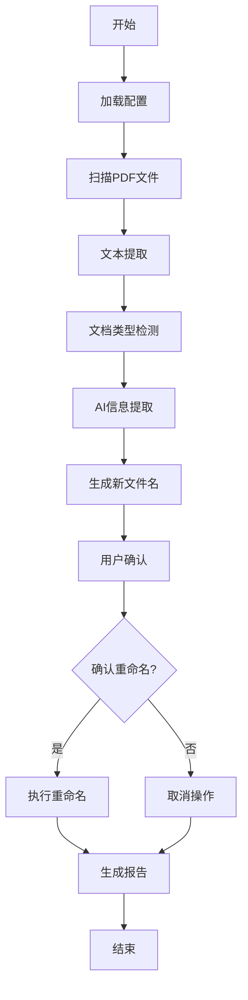

# 📚 智能文档重命名工具 v2.1 使用说明书

**作者：Baireinhold**  
**版本：v2.1.0**  
**更新日期：2025年8月5日**

---

## 📋 目录

1. [项目简介](#项目简介)
2. [功能特性](#功能特性)
3. [系统要求](#系统要求)
4. [安装指南](#安装指南)
5. [快速开始](#快速开始)
6. [详细配置](#详细配置)
7. [使用教程](#使用教程)
8. [命名模板](#命名模板)
9. [AI服务配置](#ai服务配置)
10. [常见问题](#常见问题)
11. [技术架构](#技术架构)
12. [更新日志](#更新日志)
13. [许可协议](#许可协议)

---

## 📖 项目简介

智能文档重命名工具是一款基于人工智能的PDF文档批量重命名软件。它能够自动识别PDF文档的类型（书籍或论文），提取关键信息（标题、作者、出版社/期刊、年份等），并根据用户自定义的命名规则生成规范的文件名。

### 🎯 解决的问题

- **文件名混乱**：下载的PDF文件名往往是乱码或无意义字符
- **批量处理困难**：手动重命名大量文件耗时耗力
- **命名不规范**：缺乏统一的文件命名标准
- **信息提取困难**：难以快速获取文档核心信息

### ✨ 核心优势

- **🤖 AI驱动**：使用先进的大语言模型进行文档分析
- **🔧 高度可定制**：支持自定义命名模板和处理参数
- **🌐 多AI支持**：支持OpenAI、Claude、DeepSeek等多种AI服务
- **🚀 批量处理**：一次处理多个文件，提高工作效率
- **🖥️ 跨平台**：支持Windows和macOS系统
- **🔍 智能检测**：自动识别文档类型和OCR需求

---

## 🚀 功能特性

### 📊 核心功能

| 功能模块 | 说明 | 特点 |
|---------|------|------|
| **智能分析** | AI提取文档信息 | 真实AI分析，非模拟 |
| **文档识别** | 自动区分书籍/论文 | 基于关键词智能判断 |
| **OCR检测** | 识别需要OCR的文件 | 自动添加提示标记 |
| **批量处理** | 同时处理多个文件 | 最多50个文件并发 |
| **自定义命名** | 灵活的命名模板 | 支持多种字段组合 |
| **多语言支持** | 翻译功能 | 可选择保留原文或翻译 |

### 📋 支持的文档类型

#### 📚 书籍文档
- **提取字段**：书名、作者、出版社、出版年份
- **识别特征**：ISBN、版权信息、出版社标识
- **命名示例**：`深度学习 - Ian Goodfellow (2016).pdf`

#### 📄 论文文档
- **提取字段**：文章标题、作者、期刊名、发表年份
- **识别特征**：DOI、期刊信息、会议名称
- **命名示例**：`Attention Is All You Need - Vaswani et al. (2017).pdf`

### 🎛️ 高级功能

- **页码范围控制**：自定义提取页数（1-50页），节省API成本
- **置信度评估**：AI分析结果的可信度评分
- **错误恢复**：多种PDF解析方法，提高成功率
- **日志记录**：详细的处理日志，便于问题诊断
- **预览模式**：处理前预览结果，确认后执行
- **安全备份**：可选择保留原文件

---

## 💻 系统要求

### 最低要求
- **操作系统**：Windows 10+ 或 macOS 10.14+
- **Python版本**：Python 3.8 或更高版本
- **内存**：4GB RAM
- **存储空间**：500MB 可用空间
- **网络**：稳定的互联网连接（用于AI API调用）

### 推荐配置
- **操作系统**：Windows 11 或 macOS 12+
- **Python版本**：Python 3.11+
- **内存**：8GB RAM 或更多
- **存储空间**：2GB 可用空间
- **网络**：高速稳定连接

### 依赖包
```
rich>=13.0.0          # 美观的命令行界面
requests>=2.28.0      # HTTP请求处理
python-dotenv>=0.19.0 # 环境变量管理
PyYAML>=6.0           # YAML配置文件支持
PyPDF2>=3.0.0         # PDF文件处理
pdfplumber>=0.7.0     # 高级PDF文本提取
Pillow>=9.0.0         # 图像处理支持
```

---

## 🛠️ 安装指南

### Windows 安装

#### 方法1：一键安装（推荐）
1. **下载项目文件**到任意目录
2. **双击运行** `start.bat`
3. **脚本自动完成**：
   - 检查Python环境
   - 安装所需依赖
   - 创建配置文件
   - 启动程序

#### 方法2：手动安装
```batch
# 1. 检查Python版本
python --version

# 2. 安装依赖
pip install -r requirements.txt

# 3. 创建配置文件
copy .env.template .env

# 4. 编辑配置文件
notepad .env

# 5. 运行程序
python src/main.py
```

### macOS 安装

#### 方法1：一键安装（推荐）
1. **下载项目文件**到任意目录
2. **打开终端**，进入项目目录
3. **运行启动脚本**：
   ```bash
   chmod +x start.sh
   ./start.sh
   ```

#### 方法2：使用Homebrew安装
```bash
# 1. 安装Homebrew（如果没有）
/bin/bash -c "$(curl -fsSL https://raw.githubusercontent.com/Homebrew/install/HEAD/install.sh)"

# 2. 安装Python
brew install python3

# 3. 安装项目依赖
pip3 install -r requirements.txt

# 4. 配置并运行
cp .env.template .env
nano .env
python3 src/main.py
```

### 🔧 环境配置

#### 配置AI API密钥
编辑 `.env` 文件，选择一个AI服务并配置：

```env
# DeepSeek（推荐，性价比高）
AI_API_KEY=sk-your-deepseek-api-key
AI_API_URL=https://api.deepseek.com/v1/chat/completions
AI_MODEL=deepseek-chat

# 或者选择其他服务...
```

#### 验证安装
运行以下命令验证安装：
```bash
python src/main.py --version
```

---

## 🚀 快速开始

### 第一次使用

1. **准备PDF文件**
   - 将需要重命名的PDF文件放入 `data/input` 目录
   - 或准备一个包含PDF文件的文件夹

2. **启动程序**
   - Windows：双击 `start.bat`
   - macOS：运行 `./start.sh`

3. **配置参数**
   ```
   📄 当前页码范围: 1-10页
   请输入最小页码 (1): 1
   请输入最大页码 (10): 5
   
   📁 目录设置:
   请输入PDF输入目录: /path/to/your/pdfs
   请输入输出目录: /path/to/output
   ```

4. **执行处理**
   - 程序会显示处理预览
   - 确认后开始批量处理
   - 查看处理结果

### 典型使用场景

#### 场景1：学术论文整理
```
输入文件：paper_12345.pdf
AI分析结果：
- 标题：Attention Is All You Need
- 作者：Ashish Vaswani et al.
- 期刊：NIPS
- 年份：2017

输出文件：Attention Is All You Need - Ashish Vaswani et al. (2017).pdf
```

#### 场景2：技术书籍管理
```
输入文件：book_download_v2.pdf
AI分析结果：
- 书名：深度学习
- 作者：Ian Goodfellow
- 出版社：人民邮电出版社
- 年份：2017

输出文件：深度学习 - Ian Goodfellow (2017).pdf
```

---

## ⚙️ 详细配置

### 配置文件结构

`.env` 文件包含所有配置选项，分为以下几个部分：

```env
# ====== AI服务配置 ======
AI_API_KEY=your-api-key
AI_API_URL=https://api.example.com
AI_MODEL=model-name

# ====== 处理控制 ======
MIN_PAGES=1              # 最小提取页码
MAX_PAGES=10             # 最大提取页码
MAX_FILES_PER_BATCH=50   # 批量处理文件数限制
BATCH_SIZE=5             # 并发处理数量

# ====== 命名模板 ======
BOOK_NAMING_PATTERN={title} - {author} ({year})
PAPER_NAMING_PATTERN={title} - {author} ({year})

# ====== 翻译设置 ======
ENABLE_TRANSLATION=false
TRANSLATE_BOOK_TITLE=false
TRANSLATE_BOOK_AUTHOR=false
```

### 关键配置说明

#### 页码控制
```env
MIN_PAGES=1    # 从第1页开始提取
MAX_PAGES=5    # 到第5页结束
```
- **书籍推荐**：1-5页（标题页、版权页）
- **论文推荐**：1-2页（标题、摘要）
- **长文档**：可适当增加到10-15页

#### 处理限制
```env
MAX_FILES_PER_BATCH=50   # 一次最多处理50个文件
BATCH_SIZE=5             # 同时处理5个文件
API_TIMEOUT=30           # API请求30秒超时
```

#### OCR检测
```env
OCR_PREFIX=[请OCR]       # OCR提示前缀
MIN_TEXT_LENGTH=100      # 最小文本长度阈值
AUTO_OCR_DETECTION=true  # 自动OCR检测
```

---

## 📝 使用教程

### 基础操作流程

#### 1. 启动程序
```bash
# Windows
start.bat

# macOS
./start.sh
```

#### 2. 设置处理参数
程序启动后会显示交互界面：

```
🔧 自定义设置（按回车使用默认值）:

📄 当前页码范围: 1-10页
请输入最小页码 (1): 3
请输入最大页码 (10): 6
✅ 页码范围设置为: 3-6页

📁 目录设置:
请输入PDF输入目录 (data/input): /Users/name/Documents/PDFs
请输入重命名结果输出目录 (data/output): 
```

#### 3. 选择处理模式

**复制模式（推荐）**：
- 输入和输出目录不同
- 保留原文件，生成重命名副本
- 更安全，适合重要文档

**原地重命名模式**：
- 输入和输出目录相同
- 直接修改原文件名
- 节省空间，但需谨慎使用

#### 4. 处理结果预览
```
📊 处理结果摘要:
┏━━━━━━━━━━━━━┳━━━━━━┓
┃ 统计项      ┃ 数量 ┃
┡━━━━━━━━━━━━━╇━━━━━━┩
│ 总文件数    │   10 │
│ ✅ 成功处理 │    8 │
│ 📚 书籍     │    5 │
│ 📄 论文     │    3 │
│ 🔍 需要OCR  │    2 │
│ ❌ 处理失败 │    0 │
└─────────────┴──────┘
```

#### 5. 确认执行
```
🤔 是否执行重命名操作？ [y/n]: y
确定要执行文件操作吗？ [y/n]: y
```

### 高级使用技巧

#### 技巧1：批量处理优化
- **大文件集合**：分批处理，避免API限制
- **网络不稳定**：减少并发数量，增加超时时间
- **成本控制**：减少提取页数，提高处理速度

#### 技巧2：提高准确率
- **书籍文档**：包含前5页，包含版权信息
- **论文文档**：包含前2页，包含摘要信息
- **扫描文档**：先使用OCR工具处理

#### 技巧3：自定义处理
- **命名规则**：根据个人习惯调整模板
- **翻译选项**：选择性翻译特定字段
- **文件分类**：按文档类型分别处理

---

## 🏷️ 命名模板

### 模板语法

命名模板使用Python字符串格式化语法：

```python
# 基础语法
{field_name}           # 字段名
{field_name} - text    # 字段 + 固定文本
[{field_name}]         # 方括号包围
({field_name})         # 圆括号包围
```

### 可用字段

#### 书籍字段
| 字段名 | 说明 | 示例 |
|--------|------|------|
| `{title}` | 书名 | 深度学习 |
| `{author}` | 作者 | Ian Goodfellow |
| `{publisher}` | 出版社 | 人民邮电出版社 |
| `{year}` | 出版年份 | 2017 |

#### 论文字段
| 字段名 | 说明 | 示例 |
|--------|------|------|
| `{title}` | 文章标题 | Attention Is All You Need |
| `{author}` | 作者 | Ashish Vaswani et al. |
| `{journal}` | 期刊名 | NIPS |
| `{year}` | 发表年份 | 2017 |

### 模板示例

#### 书籍命名模板
```env
# 简洁风格
BOOK_NAMING_PATTERN={title} ({year})
# 示例：深度学习 (2017).pdf

# 标准风格
BOOK_NAMING_PATTERN={title} - {author} ({year})
# 示例：深度学习 - Ian Goodfellow (2017).pdf

# 学术风格
BOOK_NAMING_PATTERN={author} - {title} ({publisher}, {year})
# 示例：Ian Goodfellow - 深度学习 (人民邮电出版社, 2017).pdf

# 详细风格
BOOK_NAMING_PATTERN=[{year}] {title} - {author} - {publisher}
# 示例：[2017] 深度学习 - Ian Goodfellow - 人民邮电出版社.pdf
```

#### 论文命名模板
```env
# 简洁风格
PAPER_NAMING_PATTERN={title} ({year})
# 示例：Attention Is All You Need (2017).pdf

# 标准风格
PAPER_NAMING_PATTERN={title} - {author} ({year})
# 示例：Attention Is All You Need - Vaswani et al. (2017).pdf

# 期刊优先风格
PAPER_NAMING_PATTERN=[{journal}] {title} - {author} ({year})
# 示例：[NIPS] Attention Is All You Need - Vaswani et al. (2017).pdf

# 作者优先风格
PAPER_NAMING_PATTERN={author} - {title} ({journal}, {year})
# 示例：Vaswani et al. - Attention Is All You Need (NIPS, 2017).pdf
```

### 自定义模板规则

1. **必须包含**.pdf扩展名（程序自动添加）
2. **避免非法字符**：`< > : " / \ | ? *`
3. **长度限制**：默认200字符以内
4. **字段可选**：不是所有字段都必须使用
5. **支持中英文**：可混合使用中英文

---

## 🤖 AI服务配置

### 支持的AI服务

| 服务商 | 模型 | 特点 | 推荐场景 |
|--------|------|------|----------|
| **DeepSeek** | deepseek-chat | 性价比高，国内快 | 日常使用 |
| **OpenAI** | gpt-3.5-turbo | 功能强大，准确率高 | 高精度需求 |
| **Claude** | claude-3-haiku | 逻辑清晰，适合分析 | 复杂文档 |
| **Google** | gemini-pro | 免费额度大 | 预算有限 |
| **智谱AI** | glm-4 | 国产，中文优秀 | 中文文档 |
| **Moonshot** | moonshot-v1-8k | 长文本处理 | 大文档 |

### 配置示例

#### DeepSeek配置（推荐）
```env
AI_API_KEY=sk-your-deepseek-api-key
AI_API_URL=https://api.deepseek.com/v1/chat/completions
AI_MODEL=deepseek-chat
```

**优势**：
- 🚀 响应速度快
- 💰 价格便宜
- 🌐 国内访问稳定
- 🎯 准确率较高

#### OpenAI配置
```env
AI_API_KEY=sk-your-openai-api-key
AI_API_URL=https://api.openai.com/v1/chat/completions
AI_MODEL=gpt-3.5-turbo
```

**优势**：
- 🏆 业界标杆
- 🧠 理解能力强
- 📊 准确率最高
- 🔧 功能最完善

#### Claude配置
```env
AI_API_KEY=sk-ant-your-claude-api-key
AI_API_URL=https://api.anthropic.com/v1/messages
AI_MODEL=claude-3-haiku-20240307
```

**优势**：
- 🎯 逻辑性强
- 📖 适合文档分析
- 🔍 细节处理好
- ⚡ 速度较快

### API密钥获取

#### DeepSeek
1. 访问 [https://platform.deepseek.com](https://platform.deepseek.com)
2. 注册账号并登录
3. 进入API密钥管理页面
4. 创建新的API密钥
5. 复制密钥到`.env`文件

#### OpenAI
1. 访问 [https://platform.openai.com](https://platform.openai.com)
2. 注册账号并完成验证
3. 进入API Keys页面
4. 创建新的密钥
5. 配置到`.env`文件

#### Claude
1. 访问 [https://console.anthropic.com](https://console.anthropic.com)
2. 申请API访问权限
3. 获取API密钥
4. 配置到`.env`文件

### 成本预估

以1000个PDF文件为例：

| 服务商 | 预估成本 | 处理时间 | 推荐度 |
|--------|----------|----------|--------|
| DeepSeek | $2-5 | 30-60分钟 | ⭐⭐⭐⭐⭐ |
| OpenAI | $10-20 | 20-40分钟 | ⭐⭐⭐⭐ |
| Claude | $5-15 | 25-50分钟 | ⭐⭐⭐⭐ |
| Google | 免费 | 60-120分钟 | ⭐⭐⭐ |

---

## ❓ 常见问题

### 安装问题

**Q: Python版本不兼容怎么办？**
A: 本工具需要Python 3.8+版本。请升级Python或使用pyenv管理多版本。

**Q: pip安装依赖失败？**
A: 尝试使用国内镜像源：
```bash
pip install -r requirements.txt -i https://pypi.tuna.tsinghua.edu.cn/simple
```

**Q: macOS权限问题？**
A: 确保脚本有执行权限：
```bash
chmod +x start.sh
```

### 配置问题

**Q: API密钥无效？**
A: 检查以下几点：
- 密钥是否正确复制
- 是否有足够的API额度
- 网络连接是否正常
- API服务是否可用

**Q: 如何选择合适的AI服务？**
A: 建议按需选择：
- **日常使用**：DeepSeek（性价比高）
- **高精度**：OpenAI GPT（准确率高）
- **预算有限**：Google Gemini（有免费额度）
- **中文文档**：智谱AI GLM（中文优化）

### 使用问题

**Q: 处理速度很慢？**
A: 可以优化以下设置：
- 减少页码范围（MIN_PAGES, MAX_PAGES）
- 降低批量大小（BATCH_SIZE）
- 选择更快的AI服务

**Q: 识别准确率不高？**
A: 尝试以下方法：
- 增加页码范围，包含更多信息
- 检查PDF文件质量，是否需要OCR
- 使用更强的AI模型
- 手动调整置信度阈值

**Q: 文件重命名失败？**
A: 检查以下问题：
- 文件是否被其他程序占用
- 文件名是否包含非法字符
- 目标目录是否存在且有写权限
- 磁盘空间是否充足

**Q: 如何处理扫描版PDF？**
A: 扫描版PDF需要OCR处理：
1. 程序会自动检测并标记`[请OCR]`
2. 使用专业OCR工具预处理
3. 或选择支持OCR的AI服务

### 错误处理

**Q: API请求超时？**
A: 增加超时时间：
```env
API_TIMEOUT=60
```

**Q: 网络连接问题？**
A: 检查代理设置或防火墙配置

**Q: 内存不足？**
A: 减少并发处理数量：
```env
BATCH_SIZE=2
CONCURRENT_WORKERS=1
```

---

## 🏗️ 技术架构

### 项目结构
```
document-renamer/
├── src/                    # 源代码目录
│   ├── main.py            # 主程序入口
│   ├── config/            # 配置管理
│   │   └── settings.py    # 配置加载器
│   ├── processors/        # 核心处理模块
│   │   ├── pdf_extractor.py   # PDF文本提取
│   │   ├── ai_analyzer.py     # AI分析器
│   │   └── file_renamer.py    # 文件重命名器
│   └── utils/             # 工具函数
│       ├── logger.py      # 日志管理
│       └── helpers.py     # 辅助函数
├── data/                  # 数据目录
│   ├── input/            # 输入文件夹
│   ├── output/           # 输出文件夹
│   └── logs/             # 日志文件
├── config/               # 配置文件
│   └── .env.template     # 配置模板
├── requirements.txt      # 依赖包列表
├── start.bat            # Windows启动脚本  
├── start.sh             # macOS启动脚本
└── README.md            # 说明文档
```

### 核心模块

#### 1. PDF文本提取器 (pdf_extractor.py)
```python
class PDFExtractor:
    def extract_text(self, file_path, min_pages, max_pages):
        # 使用多种方法提取PDF文本
        # 1. pdfplumber (首选)
        # 2. PyPDF2 (备用)
        # 3. 错误恢复机制
```

#### 2. AI分析器 (ai_analyzer.py)
```python
class AIAnalyzer:
    def analyze_document(self, text, doc_type):
        # 1. 构建提示词
        # 2. 调用AI API
        # 3. 解析结果
        # 4. 验证准确性
```

#### 3. 文件重命名器 (file_renamer.py)
```python
class FileRenamer:
    def rename_files(self, file_list, naming_pattern):
        # 1. 生成新文件名
        # 2. 验证文件名合法性
        # 3. 执行重命名操作
        # 4. 错误处理
```

### 处理流程



### 技术选型

| 技术栈 | 选择 | 原因 |
|--------|------|------|
| **语言** | Python 3.8+ | 跨平台、生态丰富 |
| **PDF处理** | pdfplumber + PyPDF2 | 互补优势，提高成功率 |
| **AI接口** | requests | 简单可靠 |
| **配置管理** | python-dotenv | 环境变量标准 |
| **命令行界面** | rich | 美观易用 |
| **日志系统** | logging | Python标准库 |

---

## 📈 更新日志

### v2.1.0 (2025年8月5日)
**新增功能**
- ✨ 支持多种AI服务（OpenAI、Claude、Google、DeepSeek等）
- 🌍 添加翻译功能，支持中英文切换
- 📊 页码范围控制，节省API调用成本
- 🔍 OCR自动检测和标记功能
- 📁 灵活的目录配置（输入输出可相同）
- 🎨 全新的用户界面设计

**优化改进**
- 🚀 提升处理速度，支持并发处理
- 🎯 改进AI提示词，提高识别准确率
- 🔧 增强错误处理和恢复机制
- 📝 完善日志记录和调试信息
- 🖥️ 完整的macOS支持

**修复问题**
- 🐛 修复文件重复查找问题
- 🔐 解决跨平台权限问题
- 📄 改进PDF文本提取稳定性
- 💾 优化内存使用效率

### v2.0.0 (2025年8月4日)
**重大更新**
- 🎯 重构核心架构，模块化设计
- 🤖 引入真实AI分析，替代模拟功能
- 📚 支持书籍和论文两种文档类型
- 🏷️ 自定义命名模板系统
- ⚙️ 全面的配置管理系统

### v1.0.0 (2025年8月4日)
**初始版本**
- 📄 基础PDF文件重命名功能
- 🔍 简单文本提取和分析
- 💻 Windows平台支持
- 📝 基础配置选项

---

## 🤝 贡献指南

### 如何贡献

我们欢迎各种形式的贡献：

1. **🐛 报告Bug**：发现问题请提交Issue
2. **💡 功能建议**：有好想法请分享
3. **📝 改进文档**：帮助完善说明书
4. **🔧 代码贡献**：提交Pull Request

### 开发环境搭建

```bash
# 1. 克隆仓库
git clone <repository-url>
cd document-renamer

# 2. 创建虚拟环境
python -m venv venv
source venv/bin/activate  # Linux/macOS
# 或
venv\Scripts\activate     # Windows

# 3. 安装开发依赖
pip install -r requirements.txt
pip install -r requirements-dev.txt  # 如果有

# 4. 运行测试
python -m pytest tests/

# 5. 代码格式化
black src/
isort src/
```

### 代码规范

- 遵循PEP 8代码风格
- 函数和类需要docstring
- 重要功能需要单元测试
- 提交前运行代码检查

---

## 📄 许可协议

本项目采用 **MIT许可协议**。

```
MIT License

Copyright (c) 2025 Baireinhold

Permission is hereby granted, free of charge, to any person obtaining a copy
of this software and associated documentation files (the "Software"), to deal
in the Software without restriction, including without limitation the rights
to use, copy, modify, merge, publish, distribute, sublicense, and/or sell
copies of the Software, and to permit persons to whom the Software is
furnished to do so, subject to the following conditions:

The above copyright notice and this permission notice shall be included in all
copies or substantial portions of the Software.

THE SOFTWARE IS PROVIDED "AS IS", WITHOUT WARRANTY OF ANY KIND, EXPRESS OR
IMPLIED, INCLUDING BUT NOT LIMITED TO THE WARRANTIES OF MERCHANTABILITY,
FITNESS FOR A PARTICULAR PURPOSE AND NONINFRINGEMENT. IN NO EVENT SHALL THE
AUTHORS OR COPYRIGHT HOLDERS BE LIABLE FOR ANY CLAIM, DAMAGES OR OTHER
LIABILITY, WHETHER IN AN ACTION OF CONTRACT, TORT OR OTHERWISE, ARISING FROM,
OUT OF OR IN CONNECTION WITH THE SOFTWARE OR THE USE OR OTHER DEALINGS IN THE
SOFTWARE.
```

---

## 📞 技术支持

### 获取帮助

1. **📖 查阅文档**：首先查看本说明书
2. **🔍 搜索Issues**：查看是否有类似问题
3. **💬 提交问题**：详细描述遇到的问题
4. **📧 联系作者**：发送邮件获取支持

### 问题模板

提交问题时请包含：

```markdown
**环境信息**
- 操作系统：Windows 11 / macOS 13
- Python版本：3.11.0
- 工具版本：v2.1.0

**问题描述**
详细描述遇到的问题...

**重现步骤**
1. 第一步...
2. 第二步...
3. 第三步...

**期望结果**
描述期望的结果...

**实际结果**
描述实际发生的情况...

**日志信息**
贴出相关的错误日志...
```

---

## 🌟 致谢

感谢所有为本项目做出贡献的开发者和用户！

特别感谢：
- 🤖 AI技术提供商（OpenAI、Anthropic、DeepSeek等）
- 📚 开源社区的优秀项目
- 🐛 Beta测试用户的反馈
- 💡 功能建议者的创意

---

**📚 智能文档重命名工具 v2.1**  
**作者：Baireinhold**  
**最后更新：2025年8月5日**

---

> 💡 **小贴士**：如果这个工具对你有帮助，请给个⭐Star支持一下！有问题随时反馈，我们会持续改进。
